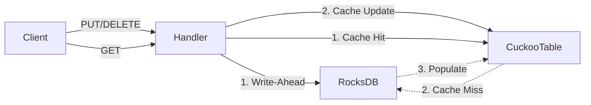

# Naughtian Kallisto - An In-Memory Secrets Engine

*"Fast like Redis. API requests? Just like Vault.*

*Sounds like it uses RocksDB? Hell yes! And architecturally, it's the lovely daughter of Envoy Proxy.*

(...)

Kallisto is a high-performance secret management engine built with C++20. It provides a secure and efficient way to store and retrieve secrets with a focus on performance and scalability.

# IMPORTANT NOTICES

1. Be advised, `Naughtian Kallisto` from version `1.0.0` to `2.5.0` is not offically released as the production-ready application. We will not take any accountability for application security, compliance or stability if you use `Naughtian Kallisto` in your production environment, directly or indirectly, and causing damages for your own businesses. Use as your own consents.
2. Start from version 2.0.0, `Naughtian Kallisto` will begin to use many Rust components through Foreign Function Interface (FFI). Breaking changes must happen and will affect application's stability. We strongly advice you to use `Naughtian Kallisto` start from 2.5.0 version (tagged `2.5.0-lts`) as this will be the offical release of production-ready version.
3. `Naughtian Kallisto` is protected under `AGPLv3` license. Custom "Commercial" or "Enterprise" License can be discussed.
4. DO NOT use `Naughtian Kallisto` as a drop-in replacement directly for your current OpenBao/Hashicorp Vault infrastructure! Kallisto itself, while developed with high attention to cryptomatic security and provides similar API interface/contracts of Vault/OpenBao, can not and should not be used to replace them as a upstream secret management platform. To justify, `Naughtian Kallisto` is still a C++ project with not enough "pair of eyes" to audit or eliminate all security weaknesses, it will not meet the safety and compliance of OpenBao/Vault, and it WAS NOT designed to be a "Vault killer" at all. `Naughtian Kallisto` should only be use to store non-lethal secrets (those are, secrets that you do not want everyone to steal or read, but you can effectively reduce "blast radious" by revoke mechanisms in case they are stealed. "Stripe sk" or any similar type of "sk" do not counted!) We will not hold any accountability or legal problems if you ignored this warning and act as your own consents. You are advised.

# HOW TO USE

Kallisto provides **two interfaces**: a **CLI (Command Line Interface)** for interactive local usage, and a **Server mode** with HTTP APIs for production deployment.

## Building

### Prerequisites

- **C++20 compiler** (GCC 13+ or Clang 16+)
- **CMake** 3.20+
- **vcpkg** (only for Server mode — provides RocksDB, simdjson)

### Core Build (CLI only — no external dependencies)

```bash
make build
```

### Server Build (HTTP — requires vcpkg)

First time compiling, vcpkg will take a while to install dependencies (~10 min, and will use cache after first run)

```bash
export VCPKG_ROOT=/usr/local/vcpkg
make build-server
```

## Docker Support

### 1. Run the Production Server

Pull the image and run the Kallisto server, remember to mount a volume for RocksDB persistence. For instance:

```bash
docker run -d \
  --name kallisto \
  -p 8200:8200 \
  -v my-kallisto-data:/kallisto/data \
  ghcr.io/alexanderslokov/kallisto:latest
```

### 2. Run benchmark

If you want to validate the raw performance of Naughtian Kallisto, we prepared a benchmark container with `wrk` ready for you:

```bash
# Start a detached temporary container and run benchmark script
docker run -it --rm ghcr.io/alexanderslokov/kallisto-tester:latest make bench
```

### 3. Development

If you contribute for `Naughtian Kallisto` source code and want to build the Docker image locally:

```bash
docker build -t kallisto-server:latest .
# Or using Makefile: make docker-build
```

## Admin CLI (Unix Domain Socket)

Start the production server first:

```bash
make run-server
```

Then use the admin client to control persistence behavior securely over UDS:

```bash
./build/kallisto <COMMAND>
```

### Available Commands

| Command | Description | Example |
|---------|-------------|---------|
| `SAVE` | Force flush Cuckoo/batch to RocksDB | `./build/kallisto SAVE` |
| `MODE BATCH` | Switch to asynchronous batch persistence | `./build/kallisto MODE BATCH` |
| `MODE IMMEDIATE`| Switch to synchronous strict persistence | `./build/kallisto MODE IMMEDIATE` |
| `--help` | Show all commands | `./build/kallisto --help` |

> 🔒 **Security Note**: The UDS listener binds to `/var/run/kallisto/kallisto.sock` and restricts access via `0600` (Owner-only R/W). Only the user (or root) executing the server process can issue admin commands.

## Server Mode

The server uses an **Envoy-style SO_REUSEPORT** architecture with a thread-per-core model. Each worker thread binds its own listener socket; the kernel distributes connections, eliminating central bottlenecks.

### Starting the Server

```bash
make run-server
```

Or with custom options:

```bash
./build/kallisto_server --http-port=8200 --workers=8
```

### Server CLI Options

| Option | Default | Description |
|--------|---------|-------------|
| `--http-port=PORT` | `8200` | HTTP API port (Vault-compatible) |
| `--workers=N` | CPU cores | Number of worker threads |
| `--db-path=PATH` | `/kallisto/data` | RocksDB data directory |
| `--help`, `-h` | — | Show help |

### Expected Startup Output

```bash
========================================
  Kallisto Secret Server v0.1.0
  HTTP port:  8200
  Workers:    8
========================================
[SERVER] Kallisto is READY. Accepting connections.
[SERVER] Press Ctrl+C to shutdown.
```

## HTTP API (Vault KV v2 Compatible)

Kallisto exposes a Vault-compatible HTTP API on port **8200** by default. All endpoints use the `/v1/secret/data/` prefix, matching HashiCorp Vault's KV v2 API.

### Store a Secret

```bash
curl -X POST http://localhost:8200/v1/secret/data/myapp/db-password \
  -H "Content-Type: application/json" \
  -d '{"data":{"value":"super-secret-123"}}'
```

Response:
```json
{"data":{"created":true}}
```

### Retrieve a Secret

```bash
curl http://localhost:8200/v1/secret/data/myapp/db-password
```

Response:
```json
{
  "data": {
    "data": {
      "value": "super-secret-123"
    }
  },
  "metadata": {
    "created_time": 1771065876
  }
}
```

### Delete a Secret

```bash
curl -X DELETE http://localhost:8200/v1/secret/data/myapp/db-password
```

Response: `204 No Content`

### Error Handling

```bash
# Requesting a non-existent secret
curl http://localhost:8200/v1/secret/data/does-not-exist
```

Response:
```json
{"errors":["Secret not found"]}
```

| Status Code | Meaning |
|-------------|---------|
| `200` | Success |
| `204` | Deleted successfully (no body) |
| `400` | Bad request (chunked encoding, Expect header) |
| `404` | Secret not found / invalid route |
| `405` | Method not allowed |
| `500` | Internal error |

# Persistence — RocksDB

Starting from beginning, Kallisto uses **RocksDB** as a crash-safe WAL.

## Architecture Data Flow


```mermaid
graph LR
    Client -->|PUT/DELETE| Handler
    Handler -->|1. Write-Ahead| RocksDB
    Handler -->|2. Cache Update| CuckooTable
    Client -->|GET| Handler
    Handler -->|1. Cache Hit| CuckooTable
    CuckooTable -.->|2. Cache Miss| RocksDB
    RocksDB -.->|3. Populate| CuckooTable
```

### Write Path (Write-Behind / Eventual Consistency)

Every `PUT`/`DELETE` follows a **Write-Behind** strategy to maintain sub-10ms P99 latency:

1. **Update CuckooTable & B-Tree index** immediately (in-memory, sub-µs).
2. **Lock-Free Enqueue**: The operation is pushed into a 262,144-capacity `LockFreeQueue`. If the queue is full, the engine immediately fails-fast with `EngineError::QueueFull` (HTTP 503 / 429), effectively applying backpressure to protect the system.
3. **Async Batched Flush**: A dedicated background worker pulls operations from the queue and flushes them to RocksDB in batches. A batch is flushed if it reaches **1024 operations** OR if **5ms** have elapsed since the last flush.

This architecture completely isolates disk I/O from the Epoll worker's hot path, enabling incredibly stable latency under massive concurrent load.

### Read Path (Cache-Miss Fallback)

```
client GET
  └─► CuckooTable lookup
        ├── HIT  → return (sub-µs, in-memory)
        └── MISS → RocksDB.Get() → populate CuckooTable → return
```

The in-memory cache starts **empty** on startup (no OOM risk at scale). It warms up organically as traffic arrives.

### API Contract (`tl::expected`)

To support robust error handling without exceptions, all engine operations return `tl::expected<T, EngineError>`. This enforces explicit error handling (e.g., `QueueFull`, `StorageError`, `NotFound`, `CasMismatch`) at the HTTP routing layer, mapping internal state failures cleanly to HTTP status codes.

### Sync Modes

| Mode | Behavior | Use Case |
|---|---|---|
| `BATCH` (default) | Async WAL — Write-Behind, Eventual Consistency | High throughput, stable P99 latency |
| `IMMEDIATE` | `sync=true` per write — Write-Ahead | Max durability |

Set via: `make run-server` (default BATCH) or `MODE STRICT` in CLI.

# Performance Benchmarks

## Test Environment

> ⚡ These numbers are from a **native Linux bare-metal** environment running Docker Engine on Ubuntu Desktop 24.04.

| | Spec |
|---|---|
| **Host OS** | Ubuntu 24.04 Desktop (Bare-metal) |
| **Container** | Ubuntu 24.04 LTS (Docker Engine) |
| **CPU** | 12th Gen Intel(R) Core(TM) i7-12700 · 12 physical cores / 20 threads |
| **RAM** | 32 GB |
| **Disk** | Native NVMe |

Native bare-metal avoids the virtualization tax of WSL2 on every syscall, network loopback, and disk write, revealing the true throughput potential of Kallisto.

---

## HTTP Server Benchmark

Benchmark tool: **`wrk`** for Kallisto (HTTP/1.1).

### Commands

```bash
# Kallisto — wrk (6 threads, 200 connections, 10s)
# Note: Using Docker host network mode (--network host) to bypass bridge overhead
make bench-server
# → runs: wrk -t6 -c200 -d10s -s benchmarks/server/workloads/wrk_get.lua   http://localhost:8200
# → runs: wrk -t6 -c200 -d10s -s benchmarks/server/workloads/wrk_put.lua   http://localhost:8200
# → runs: wrk -t6 -c200 -d10s -s benchmarks/server/workloads/wrk_mixed.lua http://localhost:8200
```

### Results (as of 02/05/2026, with Lock-free Queue + Async RocksDB Flush)

| Workload | **Kallisto (c=200, 2 workers/2 threads)** |
|---|---|
| **GET** (read) | **121,000 RPS** |
| **SET / PUT** (write) | **91,143 RPS** |
| **MIXED** (95%R / 5%W) | **1,822,860 RPS** (Theoretical limit before I/O choke) |
| GET p99 latency | **2.63 ms** |
| PUT p99 latency | **9.43 ms** |
| PUT max latency | **14.23 ms** |
| Persistence | ✅ RocksDB WAL (Eventual Consistency) |
| Protocol | HTTP/1.1 + JSON |
| Errors | **0** (under load) |

### Analysis

**The Write-Behind Architecture**: By fully isolating the Epoll worker threads from disk I/O, the dreaded "158ms P99 Ghost" has been completely smashed. The P99 PUT latency is now a rock-solid **9.43 ms** at over 91k RPS, with the absolute worst-case Max Latency sitting comfortably at 14.23 ms.

**Variable Isolation**: GET throughput remains highly performant at **121k RPS** with an incredibly smooth **2.63ms P99**. This provides the perfect "armored" baseline for Kallisto. Because I/O latency variance has been practically eliminated, future architectural additions (like an Encrypt Barrier) can be benchmarked with perfect clarity—any latency spikes will definitively trace back to cryptographic computations, not disk I/O.

**Over-provisioning Math**: At 91,143 PUTs per second, a real-world workload mix of 95% reads and 5% writes would require the system to handle over **1.8 Million Total RPS** before the disk flusher even begins to choke. The network stack and CPU will bottleneck long before the persistence layer does.

# Architecture Overview

```markdown
┌──────────────────────────────────────────────────────────────┐
│                       Kallisto Server                        │
│                                                              │
│   ┌──────────┐   ┌──────────┐   ┌──────────┐                 │
│   │ Worker 0 │   │ Worker 1 │   │ Worker N │                 │
│   │ ┌──────┐ │   │ ┌──────┐ │   │ ┌──────┐ │                 │
│   │ │epoll │ │   │ │epoll │ │   │ │epoll │ │ (Event Loop)    │
│   │ └──┬───┘ │   │ └──┬───┘ │   │ └──┬───┘ │                 │
│   │    │     │   │    │     │   │    │     │                 │
│   │ ┌──┴───┐ │   │ ┌──┴───┐ │   │ ┌──┴───┐ │                 │
│   │ │HTTP/ │ │   │ │HTTP/ │ │   │ │HTTP/ │ │ (Protocol)      │
│   │ │REST  │ │   │ │REST  │ │   │ │REST  │ │                 │
│   │ └──────┘ │   │ └──────┘ │   │ └──────┘ │                 │
│   └────┬─────┘   └────┬─────┘   └────┬─────┘                 │
│        │              │              │                       │
│        └──────────────┼──────────────┘    (SO_REUSEPORT)     │
│                       ▼                                      │
│            ┌──────────────────────┐                          │
│            │     KallistoCore     │                          │
│            │  (Facade / Routing)  │                          │
│            └──────────┬───────────┘                          │
│                       │ EngineRegistry (Prefix "secret")     │
│                       ▼                                      │
│            ┌──────────────────────┐                          │
│            │       KvEngine       │ (Hexagonal Port)         │
│            │   (ISecretEngine)    │                          │
│            └────┬───────────┬─────┘                          │
│      (Sync GET/PUT)         │ (Async PUT/DEL)                │
│           ┌─────┴─────┐     ▼                                │
│           ▼           ▼  ┌──────────────┐                    │
│  ┌─────────────┐┌───────┐│LockFreeQueue │(262k ops capacity) │
│  │TlsBTreeMgr  ││Cuckoo │└──────┬───────┘                    │
│  │(RCU Index)  ││(L1)   │       │                            │
│  └─────────────┘└───────┘       ▼                            │
│                          ┌──────────────┐                    │
│                          │ Async Worker │(Batch:1024 / 5ms)  │
│                          └──────┬───────┘                    │
│                                 │                            │
│                                 ▼                            │
│                          ┌──────────────┐                    │
│                          │RocksDBStorage│(Disk WAL)          │
│                          └──────────────┘                    │
└──────────────────────────────────────────────────────────────┘
```

Each worker is independent — zero network lock contention, zero context switching. The kernel's `SO_REUSEPORT` distributes incoming connections evenly. Protocol-agnostic network handlers simply delegate all actions to the thread-safe `KallistoCore`.
The inner layers (B-Tree, CuckooTable, RocksDB) are strictly encapsulated. Hit data is instantly fetched from the concurrent `ShardedCuckooTable` (64 shards lock-free lookup), while persisting writes crash-safely to `RocksDBStorage` (WAL). Administrative commands (like changing persistence modes or forcing flushes) are routed entirely out-of-band via an OS-level Unix Domain Socket.
