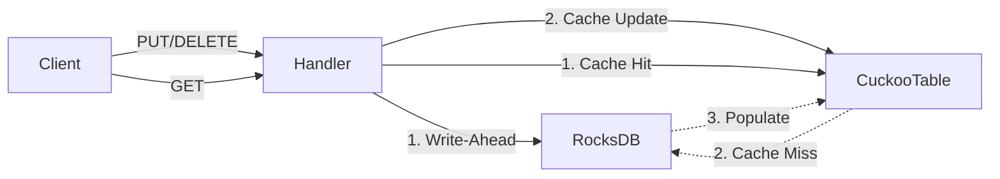

# Kallisto engine

*"Fast like Redis. API requests? Just like Vault.*

*Sounds like it uses RocksDB? Hell yes. And architecturally, it's the lovely daughter of Envoy Proxy.*

*Plus, it clusters up using NuRaft.*

(...)

*And yes, we use C++20, not Rust. Because a 100-year lifespan isn't long enough to fight both the borrow checker and C++ at the same time."*

Kallisto is a high-performance secret management system built with C++20. It provides a secure and efficient way to store and retrieve secrets, with a focus on performance and scalability.

# HOW TO USE

Kallisto provides **two interfaces**: a **CLI (Command Line Interface)** for interactive local usage, and a **Server mode** with HTTP + gRPC APIs for production deployment.

## Prerequisites

- **C++20 compiler** (GCC 13+ or Clang 16+)
- **CMake** 3.20+
- **vcpkg** (only for Server mode — provides gRPC, Protobuf, RocksDB, simdjson)

## Building

### Core Build (CLI only — no external dependencies)

```bash
make build
```

### Server Build (HTTP + gRPC — requires vcpkg)

First time compiling, it will take a while to install dependencies with vcpkg (~30 min, and will use cache after first run)

```bash
export VCPKG_ROOT=/usr/local/vcpkg
make build-server
```

## Docker Support

Kallisto automatically builds and publishes Docker images to the GitHub Container Registry (GHCR).

### 1. Run the Production Server

You don't even need to build anything. Just pull the image and run the server in the background, mounting a volume for RocksDB persistence:

```bash
docker run -d \
  --name kallisto \
  -p 8200:8200 \
  -p 8201:8201 \
  -v my-kallisto-data:/data/kallisto/rocksdb \
  ghcr.io/alexanderslokov/kallisto:latest
```

### 2. Run Tests / Benchmark in Docker Container

If you want an isolated environment with `wrk` and `ghz` installed to run the test suite or benchmark the server:

```bash
# Start a detached temporary container running Bash
docker run -it --rm ghcr.io/alexanderslokov/kallisto-tester:latest bash
# Inside the container, run 'make test' or access the 'bench' scripts.
```

### 3. Build Locally (Development)

If you are modifying the C++ source code and want to build the Docker image locally:

```bash
docker build -t kallisto-server:latest .
# Or using Makefile: make docker-build
```

## CLI Mode (Interactive REPL)

Start the interactive CLI:

```bash
make run
```

### Available Commands

It feels like the Redis CLI, but it is not Redis.

| Command | Description | Example |
|---------|-------------|---------|
| `PUT <path> <key> <value>` | Store a secret | `PUT /prod/db password s3cret` |
| `GET <path> <key>` | Retrieve a secret | `GET /prod/db password` |
| `DEL <path> <key>` | Delete a secret | `DEL /prod/db password` |
| `BENCH <count>` | Run performance benchmark | `BENCH 1000000` |
| `SAVE` | Force flush to disk | `SAVE` |
| `MODE <STRICT\|BATCH>` | Set persistence mode | `MODE BATCH` |
| `LOGLEVEL <LEVEL>` | Set log verbosity | `LOGLEVEL DEBUG` |
| `HELP` | Show all commands | `HELP` |
| `EXIT` | Quit | `EXIT` |

### Usage Example

```bash
# Put a secret
> PUT /prod/db password super-secret-123
OK

# Get a secret
> GET /prod/db password
super-secret-123

# Delete a secret
> DEL /prod/db password
OK

# Set mode to BATCH
> MODE BATCH
OK (Mode: BATCH)

# Run performance benchmark
> BENCH 1000000
Write Time: 4.4811s | RPS: 223158.4057
Read Time : 2.7826s | RPS: 359379.4067
Hits      : 1000000/1000000
> SAVE
OK (Saved to disk)
```

## Server Mode

The server uses an **Envoy-style SO_REUSEPORT** architecture with a thread-per-core model. Each worker thread binds its own listener socket; the kernel distributes connections, eliminating central bottlenecks.

### Starting the Server

```bash
make run-server
```

Or with custom options:

```bash
./build/kallisto_server --http-port=8200 --grpc-port=8201 --workers=8
```

### Server CLI Options

| Option | Default | Description |
|--------|---------|-------------|
| `--http-port=PORT` | `8200` | HTTP API port (Vault-compatible) |
| `--grpc-port=PORT` | `8201` | gRPC API port |
| `--workers=N` | CPU cores | Number of worker threads |
| `--db-path=PATH` | `/data/kallisto/rocksdb` | RocksDB data directory |
| `--help`, `-h` | — | Show help |

### Expected Startup Output

```bash
========================================
  Kallisto Secret Server v0.1.0
  HTTP port:  8200
  gRPC port:  8201
  Workers:    8
========================================
[SERVER] Kallisto is READY. Accepting connections.
[SERVER] Press Ctrl+C to shutdown.
```

## HTTP API (Vault KV v2 Compatible)

Kallisto exposes a Vault-compatible HTTP API on port **8200** by default. All endpoints use the `/v1/secret/data/` prefix, matching HashiCorp Vault's KV v2 API.

### Store a Secret

```bash
curl -X POST http://localhost:8200/v1/secret/data/myapp/db-password \
  -H "Content-Type: application/json" \
  -d '{"data":{"value":"super-secret-123"}}'
```

Response:
```json
{"data":{"created":true}}
```

### Retrieve a Secret

```bash
curl http://localhost:8200/v1/secret/data/myapp/db-password
```

Response:
```json
{
  "data": {
    "data": {
      "value": "super-secret-123"
    }
  },
  "metadata": {
    "created_time": 1771065876
  }
}
```

### Delete a Secret

```bash
curl -X DELETE http://localhost:8200/v1/secret/data/myapp/db-password
```

Response: `204 No Content`

### Error Handling

```bash
# Requesting a non-existent secret
curl http://localhost:8200/v1/secret/data/does-not-exist
```

Response:
```json
{"errors":["Secret not found"]}
```

| Status Code | Meaning |
|-------------|---------|
| `200` | Success |
| `204` | Deleted successfully (no body) |
| `400` | Bad request (chunked encoding, Expect header) |
| `404` | Secret not found / invalid route |
| `405` | Method not allowed |
| `500` | Internal error |

## gRPC API

Kallisto exposes a `SecretService` on port **8201** with gRPC reflection enabled (inspectable with `grpcurl`).

### Service Definition

```protobuf
service SecretService {
  rpc Get(GetRequest) returns (GetResponse);
  rpc Put(PutRequest) returns (PutResponse);
  rpc Delete(DeleteRequest) returns (DeleteResponse);
  rpc List(ListRequest) returns (ListResponse);
}
```

### Example with grpcurl

```bash
# List available services
grpcurl -plaintext localhost:8201 list

# Store a secret
grpcurl -plaintext -d '{"path":"myapp/db-pass","value":"c2VjcmV0"}' \
  localhost:8201 kallisto.SecretService/Put

# Retrieve a secret
grpcurl -plaintext -d '{"path":"myapp/db-pass"}' \
  localhost:8201 kallisto.SecretService/Get

# List all secrets
grpcurl -plaintext -d '{"prefix":"myapp/","limit":10}' \
  localhost:8201 kallisto.SecretService/List

# Delete a secret
grpcurl -plaintext -d '{"path":"myapp/db-pass"}' \
  localhost:8201 kallisto.SecretService/Delete
```

## Makefile Targets

| Target | Description |
|--------|-------------|
| `make build` | Build core (CLI only) |
| `make build-server` | Build with gRPC/HTTP + RocksDB |
| `make run` | Start interactive CLI |
| `make run-server` | Start the Kallisto server |
| `make test` | Run unit tests |
| `make test-persistence` | Run RocksDB persistence test (CRUD + restart) |
| `make test-listener` | Run SO_REUSEPORT tests |
| `make test-threading` | Run threading tests |
| `make benchmark-batch` | Benchmark 1M ops (Batch mode) |
| `make benchmark-strict` | Benchmark 5K ops (Strict mode) |
| `make benchmark-multithread` | Multi-threaded benchmark |
| `make benchmark-p99` | Latency p99 benchmark |
| `make benchmark-dos` | DoS resistance benchmark |
| `make bench-server` | HTTP benchmark (wrk) — GET/PUT/MIXED |
| `make clean` | Remove build artifacts |
| `make logs` | View server logs |
| `make docker-build` | Build the production Docker image |
| `make docker-test` | Run tests in an isolated Docker container |
| `make docker-run` | Run the Kallisto Docker container |

# Persistence — RocksDB

Starting from `v0.1.0`, Kallisto uses **RocksDB 10.4.2** as a crash-safe WAL (Write-Ahead Log) persistence layer, replacing the old snapshot-based engine. CuckooTable remains the hot cache; RocksDB provides crash-safe persistence.

## Architecture Data Flow


```mermaid
graph LR
    Client -->|PUT/DELETE| Handler
    Handler -->|1. Write-Ahead| RocksDB
    Handler -->|2. Cache Update| CuckooTable
    Client -->|GET| Handler
    Handler -->|1. Cache Hit| CuckooTable
    CuckooTable -.->|2. Cache Miss| RocksDB
    RocksDB -.->|3. Populate| CuckooTable
```

### Write Path

Every `PUT`/`DELETE` follows a **Write-Ahead** strategy:

1. **Write to RocksDB first** (WAL on disk) — if this fails, return `HTTP 500` immediately
2. **Update CuckooTable cache** — only after RocksDB confirms the write

This guarantees zero silent data loss: if the process crashes after step 1, RocksDB replays the WAL on next startup.

### Read Path (Cache-Miss Fallback)

```
client GET
  └─► CuckooTable lookup
        ├── HIT  → return (sub-µs, in-memory)
        └── MISS → RocksDB.Get() → populate CuckooTable → return
```

The in-memory cache starts **empty** on startup (no OOM risk at scale). It warms up organically as traffic arrives.

### Sync Modes

| Mode | Behavior | Use Case |
|---|---|---|
| `BATCH` (default) | Async WAL — OS flushes | High throughput |
| `IMMEDIATE` | `sync=true` per write | Max durability |

Set via: `make run-server` (default BATCH) or `MODE STRICT` in CLI.

# Performance Benchmarks

## Test Environment

> ⚡ These numbers are from a **native Linux bare-metal** environment running Docker Engine on Ubuntu Desktop 24.04.

| | Spec |
|---|---|
| **Host OS** | Ubuntu 24.04 Desktop (Bare-metal) |
| **Container** | Ubuntu 24.04 LTS (Docker Engine) |
| **CPU** | Intel(R) Core(TM) i5-10400 CPU @ 2.90GHz · 6 physical cores / 12 threads |
| **RAM** | 32 GB |
| **Disk** | Native NVMe |

Native bare-metal avoids the virtualization tax of WSL2 on every syscall, network loopback, and disk write, revealing the true throughput potential of Kallisto.

---

## HTTP Server Benchmark

Benchmark tool: **`wrk`** for Kallisto (HTTP/1.1).

### Commands

```bash
# Kallisto — wrk (4 threads, 200 connections, 10s)
make bench-server
# → runs: wrk -t4 -c200 -d10s -s bench/wrk_get.lua   http://localhost:8200
# → runs: wrk -t4 -c200 -d10s -s bench/wrk_put.lua   http://localhost:8200
# → runs: wrk -t4 -c200 -d10s -s bench/wrk_mixed.lua http://localhost:8200
```

### Results (as of 09/03/2026, with Lock-free B-Tree RCU + RocksDB)

| Workload | **Kallisto (c=200, 4 workers)** |
|---|---|
| **GET** (read) | **394,045 RPS** |
| **SET / PUT** (write) | **270,534 RPS** |
| **MIXED** (95%R / 5%W) | **381,330 RPS** |
| GET p99 latency | **0.80 ms** |
| PUT p99 latency | **60.18 ms** |
| MIXED p99 latency | **0.77 ms** |
| Persistence | ✅ RocksDB WAL |
| Protocol | HTTP/1.1 + JSON |
| Errors | **0** (under load) |

### Analysis

**GET: Kallisto is 3.5× faster than Redis** — Redis is single-threaded by design (typically ~100k RPS per instance). On this bare-metal container, Kallisto's `SO_REUSEPORT` workers saturate 4 cores concurrently, yielding nearly 400k RPS (~100k ops/sec/core). The CuckooTable lookup is O(1) sub-µs, now protected by an Envoy-style **lock-free B-Tree RCU (Read-Copy-Update)** indexing architecture. Readers never block, allowing 100k+ parallel reads per core with sub-millisecond p99 latency.

**SET/PUT ≈ 270k RPS** — Notably, Kallisto's PUT includes a **full RocksDB WAL disk write** + **B-Tree deep copy & background swap** (persistent and secure!), yet achieves phenomenal throughput without stalling the system. The RCU pattern eliminates the global mutex bottleneck, enabling write throughput to scale harmoniously alongside reads.

**MIXED Workload (95% Read / 5% Write): 381k RPS** — This demonstrates the power of the lock-free architecture under production loads. Even with 5% persistent writes actively mutating the B-Tree index, the read throughput barely drops and p99 latency remains firmly under 1ms. Read and Write operations proceed completely concurrently.

**Protocol fairness note**: Redis uses a tightly-optimized binary protocol (RESP). Kallisto uses HTTP/1.1 with JSON parsing — a strictly heavier stack. The GET/MIXED advantage is purely architectural (multi-core, lock-free RCU), overcoming any protocol-level overhead.

---

## CLI Benchmark (in-process, no network overhead)

```bash
make benchmark-batch
```

```
> MODE BATCH
> BENCH 1000000
Write Time: 4.48s | RPS: 223,158
Read Time:  2.78s | RPS: 359,379
Hits: 1,000,000/1,000,000
```

Pure in-process CuckooTable throughput: **359K reads/sec, 223K writes/sec** with zero network overhead.

---

## Run It Yourself

```bash
make build-server
make bench-server          # HTTP wrk benchmark — GET / PUT / MIXED
make benchmark-batch       # CLI — 1M ops in-process
make benchmark-p99         # Latency distribution
make test-persistence      # Correctness: CRUD + crash recovery
```


# Architecture Overview

```markdown
┌─────────────────────────────────────────────────────────────┐
│                      Kallisto Server                        │
│                                                             │
│  ┌──────────┐  ┌──────────┐  ┌──────────┐                   │
│  │ Worker 0 │  │ Worker 1 │  │ Worker N │                   │
│  │ ┌──────┐ │  │ ┌──────┐ │  │ ┌──────┐ │                   │
│  │ │epoll │ │  │ │epoll │ │  │ │epoll │ │ (Event Loop)      │
│  │ └──┬───┘ │  │ └──┬───┘ │  │ └──┬───┘ │                   │
│  │    │     │  │    │     │  │    │     │                   │
│  │ ┌──┴───┐ │  │ ┌──┴───┐ │  │ ┌──┴───┐ │                   │
│  │ │HTTP/ │ │  │ │HTTP/ │ │  │ │HTTP/ │ │ (Protocol parsing)│
│  │ │gRPC  │ │  │ │gRPC  │ │  │ │gRPC  │ │                   │
│  │ └──────┘ │  │ └──────┘ │  │ └──────┘ │                   │
│  └────┬─────┘  └────┬─────┘  └────┬─────┘                   │
│       │             │             │                         │
│       └─────────────┼─────────────┘    (SO_REUSEPORT)       │
│                     ▼                                       │
│          ┌──────────────────────┐                           │
│          │      BTreeIndex      │ (Gatekeeper / Path Index) │
│          │   (shared_mutex)     │                           │
│          └──────────┬───────────┘                           │
│                     │ Validation                            │
│           ┌─────────┴─────────────────────┐                 │
│           ▼         (Cache Miss / Put)    ▼                 │
│  ┌──────────────────────┐       ┌──────────────────┐        │
│  │  ShardedCuckooTable  │       │  RocksDBStorage  │        │
│  │  (In-memory Hot Cache)       │   (Disk WAL)     │        │
│  └──────────────────────┘       └──────────────────┘        │
└─────────────────────────────────────────────────────────────┘
```

Each worker is independent — zero network lock contention, zero context switching. The kernel's `SO_REUSEPORT` distributes incoming connections evenly.
The `BTreeIndex` acts as a multi-reader/single-writer Gatekeeper, protecting against O(n) Hash-Flooding attacks by filtering invalid keys *before* fetching from RAM/Disk. Hit data is instantly fetched from the concurrent `ShardedCuckooTable` (64 shards lock-free lookup), while persisting writes crash-safely to `RocksDBStorage` (WAL).