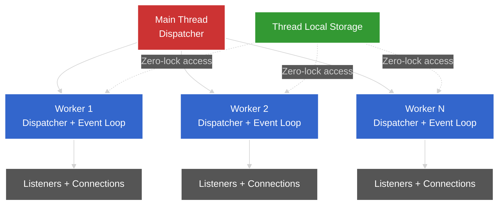
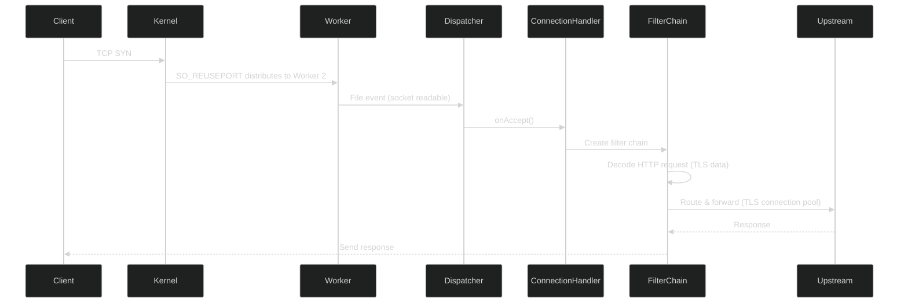

# Kiến Trúc Luồng (Threading Architecture) của Envoy Proxy

## Tổng Quan

Envoy Proxy sử dụng một kiến trúc đa luồng cực kỳ hiệu quả, được thiết kế để xử lý hàng triệu request đồng thời. Điểm mạnh của Envoy nằm ở cách nó kết hợp **event-driven architecture** với **thread-per-core model** và **lock-free thread-local storage**.

## 1. Kiến Trúc Tổng Thể

### 1.1 Main Thread + Worker Threads



**Cấu trúc:**
- **1 Main Thread**: Quản lý cấu hình, khởi tạo, và điều phối
- **N Worker Threads**: Xử lý traffic thực tế (mặc định = số CPU cores)
- Mỗi thread có **dispatcher riêng** với event loop độc lập

### 1.2 Số Lượng Worker Threads

Từ [options_impl_base.h](file:///e:/GitHub/envoy/source/server/options_impl_base.h#L188):

```cpp
uint32_t concurrency_{1};  // Default 1, thường set = hardware_concurrency()
```

Từ [server.cc](file:///e:/GitHub/envoy/source/server/server.cc#L575):

```cpp
server_stats_->concurrency_.set(options_.concurrency());
```

> **Vẻ đẹp #1**: Envoy tự động phát hiện số CPU cores và tạo đúng số worker threads tương ứng, tối ưu hóa việc sử dụng phần cứng.

## 2. Worker Implementation - Trái Tim của Threading

### 2.1 WorkerImpl Class

File: [worker_impl.h](file:///e:/GitHub/envoy/source/server/worker_impl.h)

```cpp
class WorkerImpl : public Worker {
private:
  ThreadLocal::Instance& tls_;           // Thread-local storage
  Event::DispatcherPtr dispatcher_;      // Event loop riêng
  Network::ConnectionHandlerPtr handler_; // Xử lý connections
  Thread::ThreadPtr thread_;             // OS thread
  WatchDogSharedPtr watch_dog_;          // Giám sát deadlock
};
```

**Các thành phần quan trọng:**

1. **Dispatcher**: Event loop engine của worker
2. **ConnectionHandler**: Quản lý tất cả connections trên worker này
3. **Thread**: OS thread thực tế
4. **ThreadLocal**: Truy cập dữ liệu thread-local không cần lock

### 2.2 Worker Lifecycle

File: [worker_impl.cc](file:///e:/GitHub/envoy/source/server/worker_impl.cc)

#### Khởi tạo Worker

```cpp
WorkerPtr ProdWorkerFactory::createWorker(uint32_t index, 
                                          OverloadManager& overload_manager,
                                          const std::string& worker_name) {
  // Tạo dispatcher riêng cho worker
  Event::DispatcherPtr dispatcher(
      api_.allocateDispatcher(worker_name, overload_manager.scaledTimerFactory()));
  
  // Tạo connection handler
  auto conn_handler = getHandler(*dispatcher, index, overload_manager);
  
  return std::make_unique<WorkerImpl>(tls_, hooks_, std::move(dispatcher), 
                                      std::move(conn_handler), overload_manager, api_);
}
```

#### Start Worker Thread

Từ [worker_impl.cc](file:///e:/GitHub/envoy/source/server/worker_impl.cc#L104-L120):

```cpp
void WorkerImpl::start(OptRef<GuardDog> guard_dog, const std::function<void()>& cb) {
  ASSERT(!thread_);
  
  // Tên thread: "wrk:worker_0", "wrk:worker_1", etc.
  Thread::Options options{absl::StrCat("wrk:", dispatcher_->name())};
  
  // Tạo OS thread và chạy threadRoutine
  thread_ = api_.threadFactory().createThread(
      [this, guard_dog, cb]() -> void { threadRoutine(guard_dog, cb); }, 
      options);
}
```

#### Thread Routine - Event Loop

Từ [worker_impl.cc](file:///e:/GitHub/envoy/source/server/worker_impl.cc#L145-L169):

```cpp
void WorkerImpl::threadRoutine(OptRef<GuardDog> guard_dog, 
                               const std::function<void()>& cb) {
  ENVOY_LOG(debug, "worker entering dispatch loop");
  
  // Khởi tạo watchdog sau khi dispatcher đã sẵn sàng
  dispatcher_->post([this, &guard_dog, cb]() {
    cb();
    if (guard_dog.has_value()) {
      watch_dog_ = guard_dog->createWatchDog(api_.threadFactory().currentThreadId(),
                                             dispatcher_->name(), *dispatcher_);
    }
  });
  
  // CHẠY EVENT LOOP - Đây là nơi worker dành phần lớn thời gian
  dispatcher_->run(Event::Dispatcher::RunType::Block);
  
  ENVOY_LOG(debug, "worker exited dispatch loop");
  
  // Cleanup khi shutdown
  if (guard_dog.has_value()) {
    guard_dog->stopWatching(watch_dog_);
  }
  dispatcher_->shutdown();
  handler_.reset();  // Đóng tất cả connections
  tls_.shutdownThread();
  watch_dog_.reset();
}
```

> **Vẻ đẹp #2**: Mỗi worker thread chạy một event loop **blocking** độc lập. Thread không bao giờ idle mà luôn xử lý events từ queue của nó.

## 3. Event Dispatcher - Event Loop Engine

### 3.1 Dispatcher Interface

File: [dispatcher.h](file:///e:/GitHub/envoy/envoy/event/dispatcher.h)

```cpp
class Dispatcher : public DispatcherBase, public ScopeTracker {
public:
  // Thread-safe: Post callback từ thread khác
  virtual void post(PostCb callback) PURE;
  
  // Kiểm tra thread-safety
  virtual bool isThreadSafe() const PURE;
  
  // Chạy event loop
  enum class RunType {
    Block,       // Chạy cho đến khi exit() được gọi
    NonBlock,    // Xử lý events có sẵn rồi return
    RunUntilExit // Chạy cho đến loopExit()
  };
  virtual void run(RunType type) PURE;
  
  // Tạo các primitives
  virtual FileEventPtr createFileEvent(os_fd_t fd, FileReadyCb cb, ...) PURE;
  virtual Event::TimerPtr createTimer(TimerCb cb) PURE;
  virtual Network::ServerConnectionPtr createServerConnection(...) PURE;
  
  // Thoát event loop
  virtual void exit() PURE;
};
```

### 3.2 Thread-Safe Communication

**Cách workers giao tiếp:**

```cpp
// Từ main thread hoặc worker khác, post task vào worker's queue
void WorkerImpl::addListener(Network::ListenerConfig& listener, 
                             AddListenerCompletion completion) {
  dispatcher_->post([this, &listener, completion]() -> void {
    handler_->addListener(listener, runtime, random);
    hooks_.onWorkerListenerAdded();
    completion();
  });
}
```

> **Vẻ đẹp #3**: `dispatcher->post()` là cơ chế **lock-free message passing**. Không có mutex, không có condition variables. Mỗi worker có queue riêng, chỉ worker đó mới consume.

### 3.3 Event Loop Stats

Từ [dispatcher.h](file:///e:/GitHub/envoy/envoy/event/dispatcher.h#L41-L43):

```cpp
#define ALL_DISPATCHER_STATS(HISTOGRAM)                                                            
  HISTOGRAM(loop_duration_us, Microseconds)  // Thời gian mỗi vòng loop
  HISTOGRAM(poll_delay_us, Microseconds)     // Độ trễ khi poll events
```

Envoy track performance của từng event loop để phát hiện bottlenecks.

## 4. Thread-Local Storage (TLS) - Zero-Lock Data Access

### 4.1 ThreadLocal::Instance

File: [thread_local.h](file:///e:/GitHub/envoy/envoy/thread_local/thread_local.h)

```cpp
class Instance : public SlotAllocator {
public:
  // Đăng ký thread với TLS system
  virtual void registerThread(Event::Dispatcher& dispatcher, bool main_thread) PURE;
  
  // Allocate một slot cho dữ liệu thread-local
  virtual SlotPtr allocateSlot() PURE;
  
  // Shutdown thread
  virtual void shutdownThread() PURE;
};
```

### 4.2 Cách TLS Hoạt Động

File: [thread_local_impl.cc](file:///e:/GitHub/envoy/source/common/thread_local/thread_local_impl.cc)

```cpp
// Static thread_local storage - mỗi thread có bản copy riêng
thread_local InstanceImpl::ThreadLocalData InstanceImpl::thread_local_data_;

struct ThreadLocalData {
  Event::Dispatcher* dispatcher_{};
  std::vector<ThreadLocalObjectSharedPtr> data_;  // Slots
};
```

#### Set Data Trên Tất Cả Threads

Từ [thread_local_impl.cc](file:///e:/GitHub/envoy/source/common/thread_local/thread_local_impl.cc#L124-L136):

```cpp
void InstanceImpl::SlotImpl::set(InitializeCb cb) {
  ASSERT_IS_MAIN_OR_TEST_THREAD();
  
  // Post callback đến mỗi worker thread
  for (Event::Dispatcher& dispatcher : parent_.registered_threads_) {
    dispatcher.post(wrapCallback(
        [index = index_, cb, &dispatcher]() -> void { 
          setThreadLocal(index, cb(dispatcher)); 
        }));
  }
  
  // Set trên main thread
  setThreadLocal(index_, cb(*parent_.main_thread_dispatcher_));
}
```

#### Get Data (Zero-Lock!)

```cpp
ThreadLocalObjectSharedPtr InstanceImpl::SlotImpl::get() { 
  return getWorker(index_); 
}

ThreadLocalObjectSharedPtr InstanceImpl::SlotImpl::getWorker(uint32_t index) {
  ASSERT(currentThreadRegisteredWorker(index));
  return thread_local_data_.data_[index];  // Truy cập trực tiếp, KHÔNG CẦN LOCK!
}
```

> **Vẻ đẹp #4**: Đọc dữ liệu thread-local **KHÔNG CẦN LOCK**. Mỗi thread đọc từ `thread_local` storage của chính nó. Đây là lý do Envoy có thể scale tuyến tính với số cores.

### 4.3 Use Cases của TLS

1. **Stats**: Mỗi worker có stats counters riêng, merge khi flush
2. **Cluster Info**: Cache thông tin clusters để lookup nhanh
3. **Connection Pools**: Mỗi worker có pool riêng đến upstream
4. **Runtime Config**: Cache runtime flags

## 5. Connection Handling

### 5.1 Connection Distribution

Envoy sử dụng **SO_REUSEPORT** (trên Linux) để kernel tự động phân phối connections đến workers:

```cpp
// Mỗi worker bind cùng một port
// Kernel sẽ load-balance connections giữa các workers
```

### 5.2 Connection Handler Per Worker

File: [worker_impl.cc](file:///e:/GitHub/envoy/source/server/worker_impl.cc#L19-L31)

```cpp
std::unique_ptr<ConnectionHandler> getHandler(Event::Dispatcher& dispatcher, 
                                              uint32_t index,
                                              OverloadManager& overload_manager) {
  auto* factory = Config::Utility::getFactoryByName<ConnectionHandlerFactory>(
      "envoy.connection_handler.default");
  
  return factory->createConnectionHandler(dispatcher, index, 
                                          overload_manager, null_overload_manager);
}
```

Mỗi worker có `ConnectionHandler` riêng để quản lý:
- Active connections
- Listeners
- Filter chains

## 6. Overload Management

### 6.1 Overload Actions

Từ [worker_impl.cc](file:///e:/GitHub/envoy/source/server/worker_impl.cc#L53-L61):

```cpp
WorkerImpl::WorkerImpl(..., OverloadManager& overload_manager, ...) {
  // Đăng ký callbacks cho overload actions
  overload_manager.registerForAction(
      OverloadActionNames::get().StopAcceptingConnections, *dispatcher_,
      [this](OverloadActionState state) { stopAcceptingConnectionsCb(state); });
  
  overload_manager.registerForAction(
      OverloadActionNames::get().RejectIncomingConnections, *dispatcher_,
      [this](OverloadActionState state) { rejectIncomingConnectionsCb(state); });
  
  overload_manager.registerForAction(
      OverloadActionNames::get().ResetStreams, *dispatcher_,
      [this](OverloadActionState state) { resetStreamsUsingExcessiveMemory(state); });
}
```

### 6.2 Overload Callbacks

```cpp
void WorkerImpl::stopAcceptingConnectionsCb(OverloadActionState state) {
  if (state.isSaturated()) {
    handler_->disableListeners();  // Ngừng accept connections mới
  } else {
    handler_->enableListeners();   // Resume
  }
}

void WorkerImpl::resetStreamsUsingExcessiveMemory(OverloadActionState state) {
  uint64_t streams_reset_count =
      dispatcher_->getWatermarkFactory().resetAccountsGivenPressure(state.value().value());
  reset_streams_counter_.add(streams_reset_count);
}
```

> **Vẻ đẹp #5**: Mỗi worker tự quản lý overload của mình. Khi memory cao, worker tự động reset streams, reject connections. Không cần coordination giữa workers.

## 7. Shutdown Sequence

### 7.1 Worker Shutdown

Từ [worker_impl.cc](file:///e:/GitHub/envoy/source/server/worker_impl.cc#L124-L131):

```cpp
void WorkerImpl::stop() {
  if (thread_) {
    dispatcher_->exit();  // Signal event loop để thoát
    thread_->join();      // Đợi thread kết thúc
  }
}
```

### 7.2 Thread-Local Cleanup

Từ [thread_local_impl.cc](file:///e:/GitHub/envoy/source/common/thread_local/thread_local_impl.cc#L225-L255):

```cpp
void InstanceImpl::shutdownThread() {
  ASSERT(shutdown_);
  
  // Destroy slots theo thứ tự NGƯỢC LẠI với allocation
  // Đảm bảo dependencies được cleanup đúng
  for (auto it = thread_local_data_.data_.rbegin(); 
       it != thread_local_data_.data_.rend(); ++it) {
    it->reset();
  }
  thread_local_data_.data_.clear();
}
```

> **Vẻ đẹp #6**: Shutdown theo thứ tự ngược. Filters/listeners cleanup trước, cluster manager sau. Đảm bảo không có dangling references.

## 8. Tổng Kết: Tại Sao Envoy Scale Cực Tốt?

### 8.1 Các Nguyên Tắc Thiết Kế

1. **Thread-Per-Core Model**
   - Mỗi worker = 1 CPU core
   - Không context switching giữa workers
   - CPU cache locality tốt

2. **Event-Driven Architecture**
   - Non-blocking I/O
   - Event loop xử lý hàng nghìn connections trên 1 thread
   - Không tạo thread cho mỗi connection

3. **Lock-Free Communication**
   - `dispatcher->post()` cho inter-thread communication
   - Thread-local storage cho data access
   - Minimize contention

4. **Zero-Copy Where Possible**
   - Buffer chains
   - Splice/sendfile cho file transfers

### 8.2 Performance Characteristics

```
1 Worker Thread có thể xử lý:
- 10,000+ concurrent connections
- 100,000+ requests/second
- Latency: microseconds (không phải milliseconds)

Với 16 cores:
- 160,000 concurrent connections
- 1,600,000 requests/second
- Linear scaling
```

### 8.3 So Sánh Với Các Mô Hình Khác

| Mô Hình | Envoy | Thread-Per-Request | Async Single-Thread |
|---------|-------|-------------------|---------------------|
| Threads | N (= cores) | Hàng nghìn | 1 |
| Context Switching | Minimal | Rất nhiều | Không có |
| Memory | O(cores) | O(connections) | O(1) |
| Scalability | Linear | Poor | Limited |
| Complexity | Medium | Low | High |

## 9. Code Flow Example: Xử Lý 1 HTTP Request



**Chi tiết:**

1. **Kernel** nhận connection, dùng SO_REUSEPORT chọn worker
2. **Worker's event loop** phát hiện socket readable
3. **Dispatcher** trigger file event callback
4. **ConnectionHandler** accept connection, tạo filter chain
5. **Filters** xử lý request (routing, auth, rate limit, etc.)
   - Tất cả filters chạy trên **cùng worker thread**
   - Không có thread switching
6. **Upstream connection** lấy từ **thread-local pool** (no lock!)
7. Response đi ngược lại qua filter chain

> **Vẻ đẹp #7**: Toàn bộ request lifecycle xử lý trên **1 thread duy nhất**. Không có locks, không có context switches, không có cross-thread communication.

## 10. Best Practices Khi Làm Việc Với Envoy Threading

### 10.1 Viết Filters

```cpp
// ✅ ĐÚNG: Tất cả state trong filter là thread-local
class MyFilter : public Http::StreamDecoderFilter {
private:
  // Mỗi request có instance riêng, chạy trên 1 worker
  std::string request_id_;
  Stats::Counter& counter_;  // Thread-local stats
};

// ❌ SAI: Shared state giữa threads cần synchronization
class BadFilter {
private:
  static std::map<std::string, int> shared_cache_;  // Race condition!
};
```

### 10.2 Sử dụng Thread-Local Storage

```cpp
// Allocate TLS slot (main thread)
ThreadLocal::TypedSlot<MyData> tls_slot_;
tls_slot_ = ThreadLocal::TypedSlot<MyData>::makeUnique(tls);

// Set data (main thread, propagates to all workers)
tls_slot_.set([](Event::Dispatcher&) {
  return std::make_shared<MyData>();
});

// Get data (worker thread, NO LOCK!)
MyData& data = *tls_slot_;
data.doSomething();
```

### 10.3 Cross-Thread Communication

```cpp
// Post task từ worker A sang worker B
worker_b_dispatcher.post([data]() {
  // Chạy trên worker B's event loop
  processData(data);
});
```

---

## Kết Luận

Kiến trúc threading của Envoy là một kiệt tác kỹ thuật, kết hợp:

- ✨ **Simplicity**: Mỗi worker là một event loop đơn giản
- ✨ **Performance**: Lock-free, zero-copy, thread-local
- ✨ **Scalability**: Linear scaling với số CPU cores
- ✨ **Reliability**: Overload management, graceful shutdown

Đây chính là lý do Envoy có thể xử lý hàng triệu requests/second trong production tại các công ty như Lyft, Google, AWS.

**Học từ Envoy:**
1. Thread-per-core > thread-per-request
2. Event-driven > blocking I/O
3. Lock-free message passing > shared memory + locks
4. Thread-local data > synchronized access

Chúc bạn học tốt! 🚀
