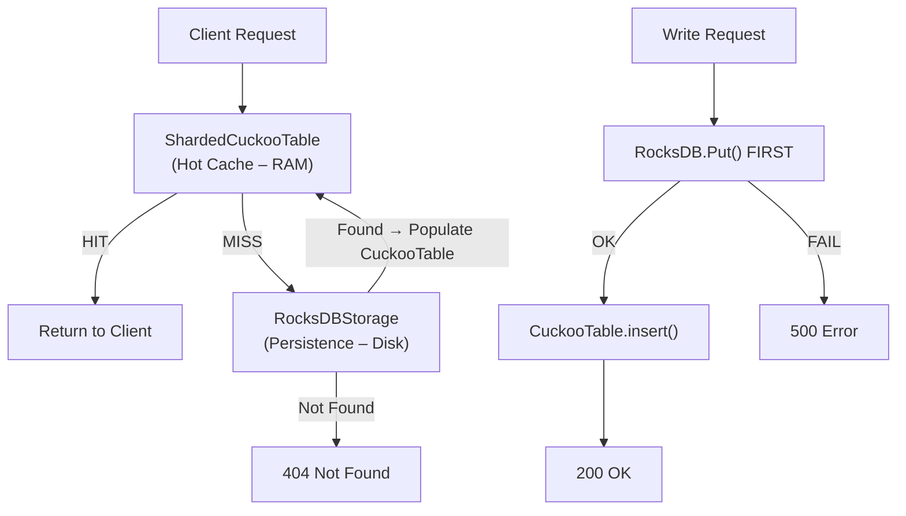

# Thay thế Local Storage bằng RocksDB (v2 — Revised)

## Bối cảnh

Kallisto hiện có **2 mô hình persistence**:

1. **CLI Mode** (`KallistoServer`): `StorageEngine` — dump toàn bộ state vào 1 file binary. Mỗi lần save = dump **tất cả entries**. Không scalable.
2. **Server Mode**: **Không có persistence** — pure in-memory. Restart = mất data.

**Mục tiêu**: Thay `StorageEngine` bằng RocksDB để có **incremental persistence**, **crash recovery** (WAL), và **tương lai chia sẻ cho NuRaft** — mà **không đụng vào** CuckooTable hay kiến trúc Envoy-like.

---

## Nguyên tắc thiết kế

> [!IMPORTANT]
> **CuckooTable là linh hồn của Kallisto.** RocksDB là persistence layer thuần túy — không cache, không thay thế CuckooTable.



---

## Data Flow chi tiết

### Write Path — "RocksDB trước, CuckooTable sau"

> [!CAUTION]
> **Thứ tự ghi là bắt buộc.** RocksDB phải thành công trước khi CuckooTable được cập nhật. Nếu RocksDB fail (disk full, stall) mà đã ghi CuckooTable → user nhận 200 OK nhưng data không persist → mất data khi restart.

```
1. Client gửi PUT /prod/db password secret123
2. persistence_->put(key, entry)          ← Ghi RocksDB TRƯỚC
   ├─ Thành công → tiếp bước 3
   └─ Thất bại   → return HTTP 500 ngay, KHÔNG đụng CuckooTable
3. storage_->insert(key, entry)           ← Ghi CuckooTable SAU
4. Return HTTP 200 OK
```

### Read Path — "CuckooTable trước, RocksDB fallback"

> [!IMPORTANT]
> **KHÔNG load toàn bộ RocksDB vào RAM lúc startup.** Nếu disk chứa 40GB secrets mà RAM chỉ có 2GB → OOM. CuckooTable chỉ chứa **hot keys** (mới ghi hoặc hay đọc).

```
1. Client gửi GET /prod/db password
2. result = storage_->lookup(full_key)    ← Tìm trong CuckooTable
   ├─ HIT  → return result               ← Sub-microsecond, done
   └─ MISS → tiếp bước 3                 ← Cache miss
3. result = persistence_->get(full_key)   ← Fallback xuống RocksDB
   ├─ Found:
   │   ├─ storage_->insert(key, entry)    ← Populate ngược vào CuckooTable
   │   └─ return result
   └─ Not Found → return 404
```

### Delete Path — "RocksDB trước, CuckooTable sau" (tương tự Write)

```
1. persistence_->del(key)                 ← Xóa RocksDB TRƯỚC
   ├─ OK → storage_->remove(key) → 204
   └─ Fail → 500 Error
```

### Startup — "Không load toàn bộ, warm-up tùy chọn"

```
1. Mở RocksDB tại /data/kallisto/rocksdb
2. CuckooTable bắt đầu TRỐNG
3. (Tùy chọn) Warm-up: load N entries gần nhất (theo timestamp)
   để hot keys có sẵn trong cache ngay lúc start.
4. Mọi request đầu tiên sẽ là cache miss → fallback RocksDB → populate CuckooTable
5. Sau vài phút, CuckooTable sẽ "ấm" tự nhiên
```

---

## Serialization Format — Binary Packing

> [!WARNING]
> `SecretEntry` chứa `std::string` (dynamic length) → **KHÔNG thể `memcpy` struct thẳng vào RocksDB.** Con trỏ nội bộ của `std::string` sẽ trỏ bậy bạ khi deserialize.

### Format: Length-Prefixed Binary

Mỗi `SecretEntry` được serialize thành byte array theo format:

```
┌─────────────────────────────────────────────────────────────┐
│ [key_len: 4B] [key_data: key_len B]                        │
│ [val_len: 4B] [val_data: val_len B]                        │
│ [path_len: 4B] [path_data: path_len B]                     │
│ [created_at: 8B, int64 epoch seconds]                      │
│ [ttl: 4B, uint32]                                          │
└─────────────────────────────────────────────────────────────┘
Tổng overhead cố định: 3×4B (lengths) + 8B + 4B = 24 bytes
```

### Pseudo-code

```cpp
// Serialize: SecretEntry → std::string (binary)
std::string RocksDBStorage::serialize(const SecretEntry& e) const {
    std::string buf;
    // Reserve ước lượng để tránh realloc
    buf.reserve(24 + e.key.size() + e.value.size() + e.path.size());
    
    auto append_string = [&](const std::string& s) {
        uint32_t len = static_cast<uint32_t>(s.size());
        buf.append(reinterpret_cast<const char*>(&len), sizeof(len));
        buf.append(s.data(), s.size());
    };
    
    append_string(e.key);
    append_string(e.value);
    append_string(e.path);
    
    int64_t ts = std::chrono::system_clock::to_time_t(e.created_at);
    buf.append(reinterpret_cast<const char*>(&ts), sizeof(ts));
    buf.append(reinterpret_cast<const char*>(&e.ttl), sizeof(e.ttl));
    
    return buf;
}

// Deserialize: std::string (binary) → SecretEntry
SecretEntry RocksDBStorage::deserialize(const std::string& data) const {
    SecretEntry e;
    const char* ptr = data.data();
    
    auto read_string = [&]() -> std::string {
        uint32_t len;
        std::memcpy(&len, ptr, sizeof(len));
        ptr += sizeof(len);
        std::string s(ptr, len);
        ptr += len;
        return s;
    };
    
    e.key = read_string();
    e.value = read_string();
    e.path = read_string();
    
    int64_t ts;
    std::memcpy(&ts, ptr, sizeof(ts));
    ptr += sizeof(ts);
    e.created_at = std::chrono::system_clock::from_time_t(ts);
    
    std::memcpy(&e.ttl, ptr, sizeof(e.ttl));
    
    return e;
}
```

**Tại sao không dùng Protobuf?** Kallisto đã có Protobuf (cho gRPC), nhưng cho persistence layer, binary packing đơn giản hơn, nhanh hơn, và không tạo dependency giữa storage format và .proto file. Nếu SecretEntry thay đổi struct, chỉ cần bump version byte ở đầu buffer.

---

## Thay đổi đề xuất

### Component 1: Dependency Setup

#### [MODIFY] [vcpkg.json](file:///workspaces/kallisto/vcpkg.json)
- Thêm `"rocksdb"` vào dependencies

#### [MODIFY] [CMakeLists.txt](file:///workspaces/kallisto/CMakeLists.txt)
- `find_package(RocksDB CONFIG)` + link `RocksDB::rocksdb` vào `kallisto_lib`

---

### Component 2: RocksDB Storage Backend

#### [NEW] [rocksdb_storage.hpp](file:///workspaces/kallisto/include/kallisto/rocksdb_storage.hpp)

```cpp
class RocksDBStorage {
public:
    explicit RocksDBStorage(const std::string& db_path = "/data/kallisto/rocksdb");
    ~RocksDBStorage();

    // Persistence operations
    bool put(const std::string& key, const SecretEntry& entry);
    std::optional<SecretEntry> get(const std::string& key) const;
    bool del(const std::string& key);
    
    // Sync control
    void flush();                  // Force WAL flush
    void set_sync(bool sync);     // Toggle sync mode

private:
    std::unique_ptr<rocksdb::DB> db_;
    rocksdb::WriteOptions write_opts_;
    
    std::string serialize(const SecretEntry& entry) const;
    SecretEntry deserialize(const std::string& data) const;
};
```

> [!NOTE]
> **Không có `load_all()`** — đã loại bỏ theo nguyên tắc không load toàn bộ DB vào RAM.

#### [NEW] [rocksdb_storage.cpp](file:///workspaces/kallisto/src/rocksdb_storage.cpp)

---

### Component 3: Tích hợp vào Server Mode

#### [MODIFY] [kallisto_server.cpp](file:///workspaces/kallisto/src/kallisto_server.cpp)

```diff
+#include "kallisto/rocksdb_storage.hpp"

 auto storage = std::make_shared<ShardedCuckooTable>(1024 * 1024);  // Giữ nguyên
+auto persistence = std::make_shared<RocksDBStorage>("/data/kallisto/rocksdb");
+// KHÔNG load_all(). CuckooTable bắt đầu trống, tự ấm dần.
```

Truyền cả `storage` và `persistence` vào HTTP/gRPC handlers.

#### [MODIFY] [http_handler.hpp](file:///workspaces/kallisto/include/kallisto/server/http_handler.hpp) & [http_handler.cpp](file:///workspaces/kallisto/src/server/http_handler.cpp)

- Thêm `std::shared_ptr<RocksDBStorage> persistence_`
- **`handlePutSecret`**: RocksDB trước → CuckooTable sau → 200 OK. RocksDB fail → 500.
- **`handleGetSecret`**: CuckooTable trước → miss → RocksDB fallback → populate CuckooTable → return.
- **`handleDeleteSecret`**: RocksDB trước → CuckooTable sau → 204. RocksDB fail → 500.

#### [MODIFY] [grpc_handler.hpp](file:///workspaces/kallisto/include/kallisto/server/grpc_handler.hpp) & [grpc_handler.cpp](file:///workspaces/kallisto/src/server/grpc_handler.cpp)

- Tương tự HTTP handler.

---

### Component 4: Tích hợp vào CLI Mode

#### [MODIFY] [kallisto.hpp](file:///workspaces/kallisto/include/kallisto/kallisto.hpp) & [kallisto.cpp](file:///workspaces/kallisto/src/kallisto.cpp)

```diff
-#include "kallisto/storage_engine.hpp"
+#include "kallisto/rocksdb_storage.hpp"

-std::unique_ptr<StorageEngine> persistence;
+std::unique_ptr<RocksDBStorage> persistence;
```

- `put_secret()`: `persistence->put()` TRƯỚC → `storage->insert()` SAU
- `get_secret()`: `storage->lookup()` → miss → `persistence->get()` → populate
- `delete_secret()`: `persistence->del()` TRƯỚC → `storage->remove()` SAU
- `force_save()` → `persistence->flush()`
- `SyncMode::IMMEDIATE` → `persistence->set_sync(true)`
- `SyncMode::BATCH` → `persistence->set_sync(false)`
- **Bỏ `rebuild_indices()` từ full load** — startup chỉ mở RocksDB, CuckooTable trống

---

## Files bị ảnh hưởng

| File | Hành động | Thay đổi |
|------|-----------|----------|
| `vcpkg.json` | MODIFY | +1 dependency |
| `CMakeLists.txt` | MODIFY | +find_package, +link |
| `include/kallisto/rocksdb_storage.hpp` | **NEW** | ~35 dòng |
| `src/rocksdb_storage.cpp` | **NEW** | ~120 dòng |
| `src/kallisto_server.cpp` | MODIFY | +persistence init |
| `include/kallisto/server/http_handler.hpp` | MODIFY | +persistence member |
| `src/server/http_handler.cpp` | MODIFY | +error-isolated dual-write, +read fallback |
| `include/kallisto/server/grpc_handler.hpp` | MODIFY | +persistence member |
| `src/server/grpc_handler.cpp` | MODIFY | +error-isolated dual-write, +read fallback |
| `include/kallisto/kallisto.hpp` | MODIFY | swap StorageEngine → RocksDBStorage |
| `src/kallisto.cpp` | MODIFY | +error-isolated dual-write, +read fallback |

---

## Verification Plan

1. **Build**: `make clean && make build-server`
2. **Unit tests**: `make test`
3. **CLI CRUD**: PUT → GET → DEL → GET (cold start, cache miss path)
4. **Server CRUD**: PUT → GET → DEL qua HTTP API
5. **Persistence test**: Write → Kill → Restart → Read (cache miss → RocksDB fallback)
6. **Error test**: Fill disk → PUT → expect 500 (không phải 200 rồi mất data)
7. **Benchmark**: `make bench-server` — so sánh với ~68K RPS baseline
